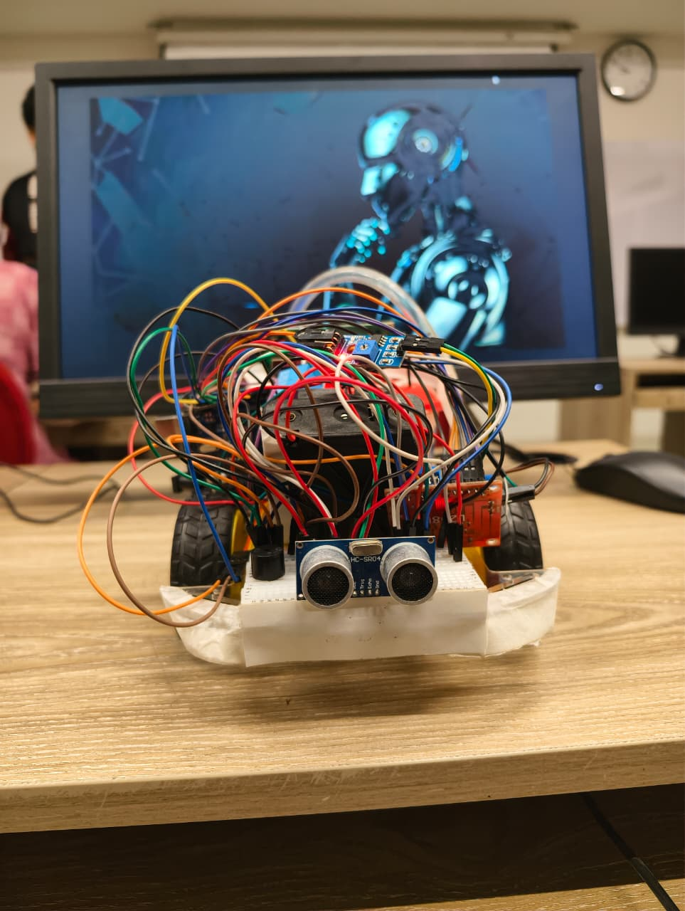

# 🌱 Smart Mobile Plant-Health Sentinel

An autonomous robotic system designed to monitor plant health, reduce water wastage, and minimize human effort through intelligent irrigation and obstacle-aware navigation.

---

## 📌 Project Overview

The **Smart Mobile Plant-Health Sentinel** is a mobile robotic platform developed for smart agriculture and automated plant care. The robot moves autonomously, checks soil moisture levels, and provides precise irrigation only when needed.

The system combines:

* Robotics
* Embedded systems
* Sensor integration
* Automation
* Intelligent decision-making

This project was developed as part of the **CSE461: Introduction to Robotics** course at **BRAC University**.

---

## 🚀 Features

✅ Autonomous movement and navigation
✅ Soil moisture sensing
✅ Intelligent watering system
✅ Obstacle detection using ultrasonic sensor
✅ Water tank monitoring
✅ Buzzer warning system
✅ Feedback-driven precise irrigation
✅ Water wastage reduction
✅ Low-power operation

---

# 🛠️ System Architecture

The robot navigates through plants using programmed movement logic and continuously checks for obstacles.

### Working Process

1. The robot moves autonomously.
2. Ultrasonic sensor scans for obstacles.
3. If an obstacle is detected:

   * Robot stops immediately
   * Buzzer starts buzzing
4. The robot reaches a plant area.
5. Soil moisture is measured.
6. If soil is dry:

   * Water pump supplies water gradually
   * Moisture is checked repeatedly
7. Watering stops once the required threshold is reached.

To prevent overwatering, a maximum watering duration is also implemented.

---

# ⚙️ Components Used

| Component                      | Quantity |
| ------------------------------ | -------- |
| Arduino Uno R3                 | 1        |
| Soil Moisture Sensor           | 1        |
| Ultrasonic Sensor (HC-SR04)    | 1        |
| Servo Motor (SG90)             | 1        |
| L298N Motor Driver             | 1        |
| Submersible Mini DC Water Pump | 1        |
| Relay Module                   | 1        |
| Water Pipe                     | 1        |
| 18650 Battery Holder           | 2        |
| 18650 Li-ion Batteries         | 5        |
| 2-Wheel Robot Car Chassis      | 1        |

---

# 🔄 Functionality

## Autonomous Navigation

* Moves automatically through the environment
* Stops periodically for moisture analysis
* Turns around after a fixed duration

## Obstacle Detection

* Uses ultrasonic sensor for distance measurement
* Stops movement when an obstacle is detected
* Activates buzzer warning system

## Intelligent Irrigation

* Detects soil moisture level
* Supplies water only when necessary
* Rechecks moisture after watering
* Prevents overwatering through threshold control

---

# 📊 Results

The robot successfully:

* Navigates autonomously
* Detects and avoids obstacles
* Measures soil moisture accurately
* Provides controlled watering
* Reduces unnecessary water usage

Testing showed that the robot can efficiently water plants while minimizing water wastage.

---

# ⚠️ Challenges Faced

* Sensor calibration inconsistencies
* Obstacle detection for small objects
* Real-time processing delays
* Overwatering and under-watering control
* Component placement limitations
* Hardware-software integration complexity

---

# 🌍 Sustainability & Impact

## Sustainability

* Reduces water wastage
* Uses low-power components
* Minimizes human effort

## Impact

* Useful for urban gardening
* Helps beginners maintain plants
* Reduces manual labor

---

# 🔮 Future Improvements

* Mobile application integration
* AI-based plant disease detection
* GPS-based navigation
* Improved obstacle avoidance
* Better sensor accuracy

---

# 📷 Project Images

## Robot Prototype

md

---

# 💻 Technologies Used

* Arduino
* Embedded C/C++
* Robotics
* Sensor Integration
* Automation Systems

---

# 👥 Team Members

| Name                    | ID       | Role                    |
| ----------------------- | -------- | ----------------------- |
| Shiva Prasad Sarkar     | 23101302 | Hardware Lead           |
| Rudaba Tabassum         | 22299125 | Documentation & Testing |
| Debashish Chowdhury     | 22201220 | Sensor Integration      |
| Md. Affan Hossain Rakib | 22201936 | Software Lead           |

---

# 📚 References

1. Arduino Uno Rev3 Documentation
2. SparkFun Soil Moisture Sensor Guide
3. IoT Based Smart Agriculture Research Papers

---

# 📄 Course Information

**Course:** CSE461 - Introduction to Robotics
**Institution:** BRAC University
**Semester:** Spring 2026

---

# ⭐ Conclusion

The Smart Mobile Plant-Health Sentinel demonstrates how robotics and automation can improve sustainable plant care. By combining mobility, sensing, and intelligent watering, the system reduces water wastage while simplifying plant maintenance.

This project highlights the potential of robotics in solving real-world agricultural and sustainability challenges.
